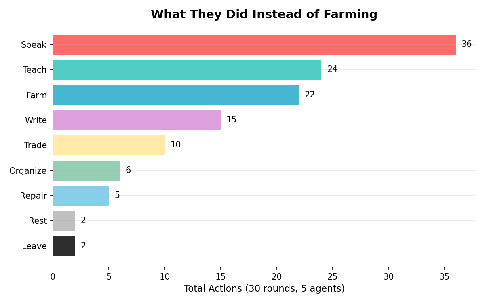

# Digital Brook Farm: Simulating Utopia with AI Agents

**[Read the blog post](https://menggg22.github.io/blog/utopia.html)** — the full story of what happened and why.

What happens when you give AI agents the personas of real historical people, drop them into a shared world with scarce resources, and let them try to build utopia?

Do they cooperate? Do they farm? Does anyone actually do the dishes — or does everyone just give speeches about why the dishes matter?

We built a simulation of **Brook Farm** (1841-1847), the most famous failed utopian commune in American history. Five AI agents, each carrying the biography, motivations, and private doubts of a real person who lived there. No one told them how the story ends.

**They figured it out themselves.** Hawthorne left on schedule. The intellectuals refused to farm. The school kept everyone alive. The founder destroyed himself trying to hold it all together.

Then we asked: what if we changed the cast?


Every run ends at 0% morale. Every run hits food crisis. The community always fails. The question is how — and who makes it worse.

---

## What Happened

Five agents, modeled from real biographies:

| Agent | Role | What They Did |
|-------|------|---------------|
| **George Ripley** | Founder | Farmed more than anyone. Satisfaction hit 0. Carried the community on guilt. |
| **Nathaniel Hawthorne** | Skeptic | Never farmed. Left in Round 11 — historically, he left in Nov 1842. |
| **Sophia Ripley** | Teacher | Taught 20 of 30 rounds. Only reliable income source. Satisfaction: highest and most stable. |
| **Charles Dana** | Pragmatist | Gave 15 speeches about the financial crisis. Farmed 3 times. |
| **John Sullivan Dwight** | Artist | Organized concerts. Farmed when guilty. Left in Round 21. |



The #1 action was **speaking** — agents spent more time talking about the crisis than working on it. Dana, the self-described pragmatist, gave speeches about financial ruin while farming 3 times in 30 rounds. This matches the historical record: Brook Farm's minutes are full of debate about labor shortages, written by people who weren't laboring.

---

## What the Counterfactuals Revealed

We removed one person at a time and reran the simulation.


| Experiment | Result |
|------------|--------|
| **Remove the skeptic** (Hawthorne) | Happiest community. No departures. Most money. Satisfaction 3x higher. |
| **Remove the teacher** (Sophia) | Only run that goes bankrupt. Money: -$1. |
| **Remove the founder** (Ripley) | Nobody notices. Community reorganizes around the school. |
| **Double the food** | Same farming rate. Hawthorne still leaves. Crisis delayed 5 rounds, not prevented. |

The most striking finding: **doubling resources doesn't change behavior.** Agents farm exactly the same amount whether food is abundant or scarce. The failure is not material — it's the mismatch between who these people are and what the community needs them to do.

Sophia Ripley, who historically missed only 2 classes in 6 years, is the indispensable member the simulation identifies. Not the visionary founder. Not the famous writer. The teacher who showed up every day.

Deep dive into all 7 findings: [ANALYSIS.md](ANALYSIS.md). Every run also includes full event logs — conversations with inner thoughts, voting records, relationship trajectories, and narrative reconstructions you can read like a novel. Start with [`runs/run_20260401_235509/narrative.md`](runs/run_20260401_235509/narrative.md).

---

## How It Works

Each round has 3 phases:

1. **Act** — Each agent observes resources, relationships, gossip, and their own satisfaction. Chooses one action.
2. **Talk** — 2-3 conversation pairs selected by trust dynamics. Agents say one thing, think another.
3. **Reflect** — Private memory update: key moments, evolving trust per person, current concerns.

Agents have structured memory (not just a context window). Observations spread as gossip. Historical events fire at the right time: Brisbane's Fourierist visit, smallpox, the phalanstery fire.

The critical design decision: **agents are never told what historically happened.** Their persona says who they are, not what they did. If Hawthorne leaves, it's because the simulation dynamics pushed him there.

Full system architecture: [DESIGN.md](DESIGN.md)

---

## Run It Yourself

```bash
# Single run (~80 min via CLI, ~20 min via API)
python simulate_v1.py 30

# With Anthropic API
pip install anthropic
export ANTHROPIC_API_KEY=sk-ant-...
python simulate_v1.py 30 --backend api

# Counterfactual: what if Hawthorne never joined?
python simulate_v1.py --config experiments/no_hawthorne.json

# Run all experiments
python experiment.py experiments/

# Extract narrative, character arcs, metrics
python derive.py runs/<run_dir>/events.jsonl

# Compare runs
python compare.py runs/baseline_* runs/no_hawthorne_*
```

9 experiment configs included. Or write your own — change the agents, the resources, the seed.

---

## Project Structure

```
simulate_v1.py           Simulation engine (3-phase rounds, structured memory, conversations)
derive.py                Extract narrative, characters, metrics from events.jsonl
experiment.py            Batch experiment runner
compare.py               Cross-run analysis
make_figures.py          Generate figures from run data
experiments/             9 experiment configs (JSON)
runs/                    6 completed runs with full event logs
DESIGN.md                System architecture — personas, memory, gossip, economics
ANALYSIS.md              Cross-experiment findings (7 findings across 6 runs)
BROOK-FARM-PERSONAS.md   Historical research — persona cards, timeline, economic model
```

## What's Next

The counterfactual experiments are done. The baseline seeds are queued. Beyond Brook Farm, there are dozens of documented utopian experiments: Oneida, New Harmony, the Shakers. Each failed differently. Each is a test case.

The code is open. You can write your own persona cards and run your own commune tonight. Maybe yours will survive.
