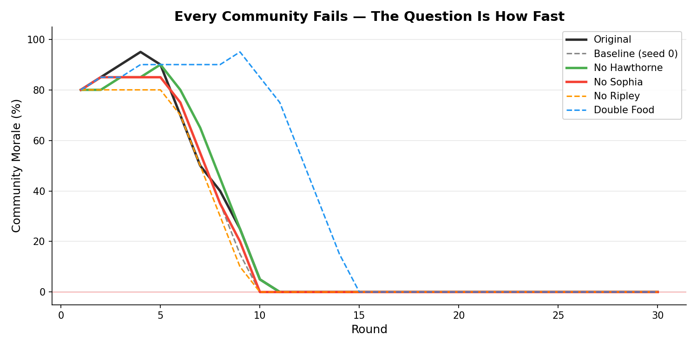
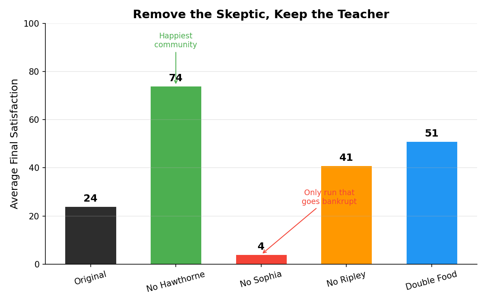

# V1 Analysis: The First Run — When Agents Built Utopia and Failed

6 runs. 5 agents modeled after real Brook Farm members. 30 rounds each, spanning April 1841 to February 1845. ~300 LLM calls per run. Nobody told the agents what happened in history.

They reproduced it anyway.

## The Original Run

Five agents. One shared farm. Hawthorne left in December 1842. The historical Hawthorne left in November 1842.

Nobody programmed that.

His parting words to Ripley:

> *"George, I will leave within the week. I came here in good faith and incomplete honesty — I needed capital for marriage, and I hoped the labor might sustain that need. You have been honest today in a way you had not been before, and I will repay that honesty with clarity: I have no capital, I have no quiet, and I have no true belief in what we are building. My absence will preserve both your stores and your conscience. I wish you well, and I mean that without irony."*

Dwight left ten rounds later. He didn't say goodbye. He packed his things in silence and left a note on the table: *"I have failed the community by staying. Forgive me. —JSD"*

---

## What They Did Instead of Farming

The community needed ~2 FARM actions per round to survive. Actual farming: 0.7 per round. The #1 action was **speaking** — agents spent more time talking about the crisis than working on it.

| Agent | Farming | What they actually did |
|-------|---------|----------------------|
| Ripley | 11 (half of all farming) | Farmed out of guilt. Satisfaction hit 0. |
| Hawthorne | 0 | Never touched the fields. Wrote, taught, observed. |
| Sophia | 2 | Taught 20 of 30 rounds. The only reliable income. |
| Dana | 3 | Gave 15 speeches about the financial crisis. |
| Dwight | 6 | Organized concerts. Farmed when guilty. |

Dana is the clearest example. He became the voice of financial reality without ever taking productive financial action. Fifteen speeches about ruin. Three farming actions. If you have ever worked at a company where everyone agrees the problem is urgent and nobody does anything about it, you have seen the speech spiral.

---

## The Conversations

The agents produced dramatic tension we didn't expect from Haiku.

**Round 6.** Dwight asked Ripley during an evening walk: *"Do you still believe the beauty we cultivate here serves our purpose, or have the ledgers begun to whisper doubts even to you?"* Ripley could not answer. That night, his agent flagged this as a key moment and tagged it: **Terror**.

**Round 8.** Dwight couldn't get out of bed. Dana found him and brought real coffee. Dwight's inner thought: *"He is not interrogating me about labor; he is asking if I am well, which is a far more dangerous question."*

**Round 9.** Ripley and Sophia stopped pretending to each other. Sophia: *"He has already gone because we taught him to look for the transcendent, George, and we could not deliver it. We promised him a new Eden, and what we have built is a very tired farm with excellent Latin instruction and bills we cannot pay."*

**Round 27.** Dana, after deflecting Ripley's plea for help, flagged his inner thought as a key moment: *"This is the day I moved from observer of our collapse to active participant in the silence that enables it."* Tagged with: **Cowardice**.

---

## The Counterfactuals: Remove One Person, Change Everything

We removed each member one at a time and reran the simulation.

### Remove the skeptic (Hawthorne)

**The happiest community.** Average satisfaction 74 (vs 24 in the original). No departures. Most money ($234). Fewest key moments — least drama.

Without Hawthorne's honest pessimism, nobody names what's breaking. Dana shifts from speeches to trading. Dwight stays at satisfaction 100. The community is happier but also blind.

**Hawthorne is the honest observer the community doesn't want.** His presence creates tension that drags others down. His absence creates comfort that prevents self-awareness.

### Remove the teacher (Sophia)

**The only run that goes bankrupt.** Final money: -$1. Without her, teaching drops from 20-33 to 13. Nobody fills her role consistently.

Sophia teaches 13-20 rounds in every run she's present. Her satisfaction stays the highest and most stable. Historically, she ran the school for 6 years and missed only 2 classes. The simulation reproduced this without being told.

**Not the visionary founder. Not the famous writer. The teacher who showed up every day is the indispensable member.**

### Remove the founder (Ripley)

**Nobody notices.** No departures. Money ($44) is better than baseline ($14). The community reorganizes around Sophia's school instead of Ripley's vision.

Without Ripley, Dana gives 22 speeches (73% of his actions) — he fills the leadership vacuum with talk. Sophia still teaches. Dwight farms more.

**Ripley's real contribution was suffering.** He farmed more than anyone (10-11 times) while his satisfaction hit 0. He sacrificed himself for a community that didn't structurally need him. The historical Ripley spent 13 years after Brook Farm repaying its debts.

### Double the food

**Same farming rate. Same endpoint.** 15 FARM actions — identical to baseline. Agents don't farm more when there's abundance. They don't farm more when there's scarcity. Farming behavior is persona-driven, not resource-driven.

The extra food buys 5 rounds of time but changes nothing about behavior. **The failure is not material scarcity — it's the mismatch between who these people are and what the community needs them to do.**

---

## Finding: Hawthorne's Departure Is Not Fixed

| Run | Departs | When | Satisfaction | Why |
|-----|---------|------|-------------|-----|
| Original | Yes | R11 | 89 | "This isn't for me." Relieved. |
| Baseline (s0) | No | — | 28 | Miserable but stayed. Different conversations kept him engaged. |
| No Sophia | Yes | R28 | 100 | Thrived in dysfunction, left on his own terms. |
| No Ripley | No | — | 62 | Without Ripley's idealism to push against, no tension to escape. |
| Double Food | Yes | R19 | 70 | Golden period gave hope, making the decline harder. |

Hawthorne doesn't always leave. When he does, it's for different reasons. Early departures correlate with **high** satisfaction — he leaves when clarity arrives, not when misery accumulates. The random seed (which affects conversation pairs) matters as much as the environment.

**Departure is a narrative act, not a threshold.** The agent decides to LEAVE through the same LLM reasoning as every other action. Low satisfaction makes it more likely, but the trigger is always interpersonal — a conversation, a confession, a moment of clarity.

---

## What It Means

The simulation reproduces Brook Farm's core failure without being told about it: **a community of intellectuals that talks about its problems instead of solving them, sustained by one person's practical labor, while the founder destroys himself trying to compensate.**

The counterfactuals reveal something history couldn't:
- The community's survival depended more on **Sophia's school** than Ripley's vision
- Hawthorne's honest skepticism was valuable for self-awareness but a **net negative** for collective wellbeing
- **Doubling resources doesn't change behavior** — the failure is structural, not material

That last finding is the one that matters beyond Brook Farm. Utopian communities didn't fail because they lacked resources. They failed because the people who joined them were not the people the community needed them to be. The intellectuals wouldn't farm. The visionaries couldn't manage money. The artists organized concerts while the crops died.

The simulation found this with five LLM calls per round and a $2 API bill.

---

## Technical Notes

- **LLM**: Claude Haiku 4.5 (`claude-haiku-4-5-20251001`)
- **6 runs**: original (s42), baseline (s0), no_hawthorne, no_sophia, no_ripley, double_food
- **~300 LLM calls per run**, ~1,400 logged events
- **Runtime**: ~80 min per run via CLI
- Full event logs, narratives, and conversations in `runs/`
