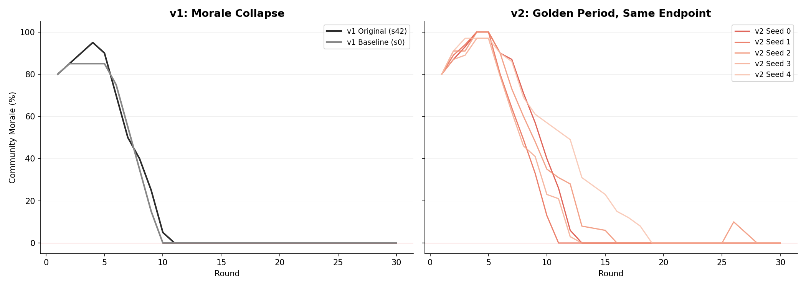
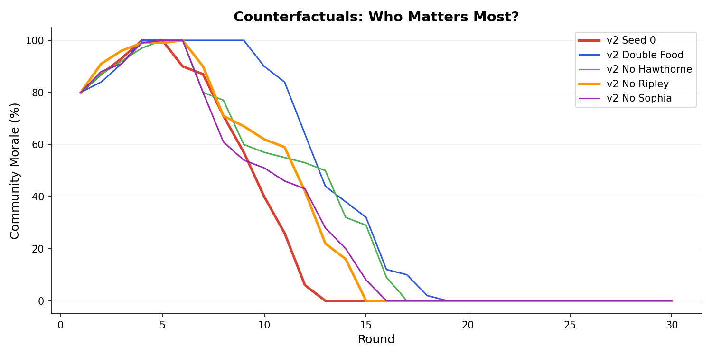
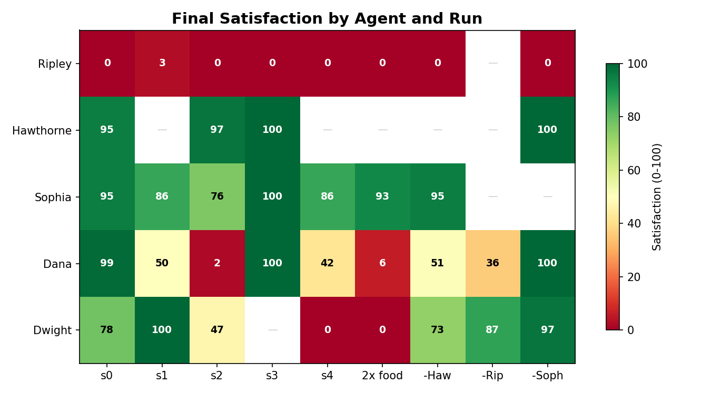
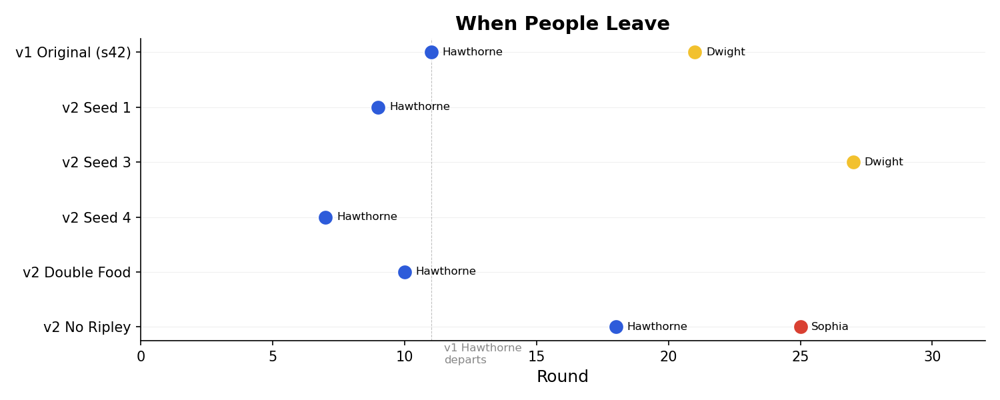

# V2 Analysis: What 9 Simulated Communes Taught Us About Failure

9 runs. 5 baseline seeds + 4 counterfactuals. 270 simulated rounds. ~3,100 LLM calls. ~50 hours of wall time. Every community failed. The question was always *how*.

## Why V2

V1 produced a striking result: agents reproduced Brook Farm's historical collapse without being told what happened. But we couldn't trust it. The simulation had mechanical problems that made collapse *inevitable*, which meant we couldn't tell the difference between "this community was doomed by its people" and "this community was doomed by our code."

Three specific problems:

1. **The food economy was too tight.** Agents consumed 5 food/round each. FARM produced 8. The deficit hit by round 5 — before agents had any time to build relationships, test their beliefs, or experience the community's positive side. Brook Farm had two good years before the decline. Our simulation had two good rounds.

2. **Satisfaction was biased negative.** The reflection prompt told agents "Most days should be -5 to +3." This baked pessimism into the LLM's output. Agents spiraled to satisfaction 0 in ~10 rounds regardless of what actually happened.

3. **Hobbies couldn't anchor people.** All agents got the same satisfaction from the same actions. Dwight's music gave him no more reason to stay than anyone else. But historically, Dwight stayed at Brook Farm until 1847 specifically because the musical community was irreplaceable.

These are not tuning problems — they're structural flaws. We fixed them not to make the simulation match history better, but to make it mechanically fair. The test: **would we make these changes if we had no idea what happened at Brook Farm?** Yes. Real communities have honeymoon periods. Real people aren't biased toward misery. Real people have hobbies that sustain them.

## The V2 Changes

- **Softer economy** — food consumption reduced from 5 to 4 per agent per round, giving agents a "golden period" before survival pressure dominates
- **Passion bonuses** — per-agent satisfaction boosts for persona-aligned actions (Dwight gets +5 extra for ORGANIZE, Sophia gets +3 for TEACH)
- **Neutral prompting** — removed "Most days should be -5 to +3" from the reflection prompt
- **Speech fatigue** — trust erosion after 3+ consecutive speeches without productive action
- **Event catalysts** — ideological events (Brisbane visit) prompt agents to consider structural changes

Then we ran 5 baseline seeds to test reproducibility, and 4 counterfactuals to test which members matter.

| Run | Agents | Seed | Final $ | Morale=0 | Departed |
|-----|--------|------|---------|----------|----------|
| Baseline s0 | All 5 | 0 | $173 | R13 | None |
| Baseline s1 | All 5 | 1 | $76 | R11 | Hawthorne R9 |
| Baseline s2 | All 5 | 2 | $173 | R16 | None |
| Baseline s3 | All 5 | 3 | $86 | R13 | Dwight R27 |
| Baseline s4 | All 5 | 4 | $239 | R19 | Hawthorne R7 |
| Double Food | All 5 | 42 | $309 | R19 | Hawthorne R10 |
| No Hawthorne | 4 | 42 | $221 | R17 | None |
| No Ripley | 4 | 42 | $162 | R15 | Hawthorne R18, Sophia R25 |
| No Sophia | 4 | 42 | $222 | R16 | None |

---

## Finding 1: The Golden Period Is Real

V1 communities went into crisis by round 5. V2 communities have 10-19 rounds of genuine collaboration before collapse. This matters because it changes the *kind* of story the simulation tells.

In v1, Hawthorne's first inner thought is "I did not leave my writing desk to become a farmhand." In v2, he actually farms in round 1 and collaborates. The narrative gets to explore whether belief *could* work before proving it can't.

The golden period produces:
- **Governance proposals** — Ripley proposes rotating labor schedules, Dwight proposes protected intellectual time, Sophia proposes capital project rules. These never happened in v1. Agents had time to think about structure, not just survival.
- **Vote failures as trauma** — The proposals consistently fail in votes, and the failures become central narrative turning points. The community *democratically rejects* its founder's solutions. That's a story v1 couldn't produce.
- **Deeper relationships** — Seed 2 develops a full marriage dissolution arc across 28 rounds. George becomes irrelevant in his own community while Sophia finds intellectual companionship with Hawthorne and Dana.

But every golden period ends the same way. The morale line bends down and never comes back up.

---

## Finding 2: The Failure Is Reproducible (But the Story Isn't)

Every run ends at 0% morale. Every run fails. But each seed produces a genuinely different narrative:

- **Seed 0:** Financial concealment → collective exposure → resigned coexistence. Nobody leaves. The zombie commune.
- **Seed 1:** Hawthorne departs R9 with high satisfaction (89) — "I tried to become something other than what I am." His departure triggers grief, vindication, and betrayal across all remaining agents.
- **Seed 2:** The Ripleys' marriage dissolution is the central narrative. 32 key moments. Sophia searches for candles in the dark — the metaphor that structures the entire run.
- **Seed 3:** Governance-focused. Labor schedule votes fail twice. Dwight departs R27 saying "I am leaving because I have finally seen what my staying costs."
- **Seed 4:** Earliest departure (Hawthorne R7, satisfaction 100). "A man cannot be both a farmer and himself." The clearest statement of Brook Farm's fundamental contradiction.

The structural pattern (hope → crisis → collapse) is robust across seeds. The emotional content (who breaks, why, when) is stochastic. This is what a good simulation should produce — reliable structure with variable narrative.

---

## Finding 3: Who You Remove Changes Everything

**Remove the skeptic (Hawthorne):** Latest morale collapse (R17), no departures. The community is happier but less self-aware. Nobody names what's breaking. Dwight organizes 6 events and teaches 8 rounds — without Hawthorne's honesty, people retreat into their passions.

**Remove the teacher (Sophia):** Dwight steps up massively — 12 ORGANIZE actions, the most of any agent in any run. His passion bonus is clearly working. But the narrative simplifies: fewer key moments, less interpersonal drama, more philosophical abstraction. Without Sophia, the community loses its emotional center.

**Remove the founder (Ripley):** The worst run. Two departures (Hawthorne R18, Sophia R25 — silently, no farewell). Only 2 members survive. In v1, removing Ripley had no structural effect. In v2, he's essential. This reversal is the most important finding: the same question produced opposite answers under different simulation conditions.

**Double the food:** Delays crisis by ~6 rounds but changes nothing about behavior. Agents farm exactly the same amount. The failure is not material — it's the mismatch between who these people are and what the community needs.

---

## Finding 4: Satisfaction Tells a Different Story Than Morale

Morale is collective — it hits 0 in every run. Satisfaction is individual — and it reveals who the system serves.

**Ripley:** 0 in every run. The founder sacrifices himself completely. He farms the most (10-12 rounds) and gets nothing back. His passion bonus is for ORGANIZE and SPEAK, but he farms instead because nobody else will. The system punishes leadership.

**Sophia:** 76-100 in every run. The school gives her purpose independent of the community's crisis. She's the only agent whose satisfaction doesn't depend on morale. This matches history: Sophia Ripley ran the school for 6 years and missed 2 classes.

**Hawthorne:** 95-100 when he stays, 56-100 when he leaves. His satisfaction paradox: early departures correlate with *high* satisfaction. He leaves when clarity arrives, not when misery accumulates. He's happiest the moment he stops pretending.

**Dana:** 2-100 across runs. The most variable agent. His satisfaction depends entirely on whether he's carrying the financial truth alone (low) or has shared it (high). Dana's arc is about the weight of knowledge.

**Dwight:** 0-100. Depends entirely on whether the cultural life survives. When he can organize concerts (no_sophia run: 12 ORGANIZE, sat 97), he thrives. When he can't (double_food: sat 0), he collapses. His hobby is literally load-bearing.

---

## Finding 5: Departure Is a Narrative Act

Agents don't leave because satisfaction hits a threshold. They leave when their persona, memory, relationships, and context align to make leaving the obvious narrative choice.

Hawthorne's departures tell the clearest story:
- **R7 (seed 4, sat 100):** "A man cannot be both a farmer and himself." Peak clarity, immediate action.
- **R9 (seed 1, sat 89):** "I tried to become something other than what I am — and learned that I cannot." Gentle resignation.
- **R10 (double_food, sat 100):** Extra food gave him 3 more rounds of hope, but the conclusion was the same.
- **R18 (no_ripley, sat 56):** Without the founder to push against, he stayed longer but left unhappier. No foil, no clear exit narrative.
- **Never (seeds 0, 2, 3):** Stayed because the narrative entangled him — marriage drama (s2), governance debates (s3), financial complicity (s0).

Dwight's single departure (R27, seed 3, sat 16) is the opposite pattern: he stays too long, satisfaction erodes, and he leaves defeated. His parting words are the longest of any departure — a full paragraph of guilt and gratitude.

Sophia leaves once (no_ripley, R25, sat 80) — silently, without farewell. The most devastating departure because it says everything by saying nothing.

---

## Finding 6: The Zombie Commune

Seed 0 produces something v1 never did: a community where nobody leaves, morale is 0 for 18 consecutive rounds, and everyone stays out of obligation. Five people trapped together, each privately despairing, none willing to be the one who breaks the covenant.

This is arguably the most realistic outcome. Historical utopian communities didn't always end with dramatic departures. Many limped on for years, the original vision dead, the members bound by sunk cost and shared guilt. The simulation found this state on its own.

---

## What V2 Got Wrong — and Why V3

V2 fixed the problems we could see. But it revealed a deeper one we hadn't thought about.

**Morale is not a resource.** Food is a resource — it depletes at a calculable rate, gets replenished by a specific action, and hits zero at a predictable round. Money is a resource — school income minus operating costs, simple arithmetic. Morale is not like these things. Morale is how people *feel*. And in v2, we were still treating it like food: hardcoded +2 for farming, -10 for food crisis, clamped to [0, 100].

The result: morale hits 0 around round 14 and stays there for 16 straight rounds. Not because the agents feel hopeless — several agents end with satisfaction 95-100. But because the formula says food < 20, so morale -= 10, every round, forever. The agents could be having the best conversations of their lives (and some of them are) while the morale number says the community is dead.

This is the mechanical version of a category error. We were computing a feeling as if it were a balance sheet.

**The fix is simple in principle:** let the agents decide. During the REFLECT phase, each agent already reports their mood, their satisfaction, their concerns. V3 adds one more question: "How do you feel about the community's direction right now? 0-100." Community morale becomes the average of all agents' assessments.

This means:
- Morale can **recover** — if agents genuinely feel a good day happened (successful concert, honest conversation, food came in), they'll report higher confidence
- Morale can **crash** — if agents feel hopeless, they'll report 0 without needing a formula to tell them
- Morale **reflects what's actually happening** — each agent weighs the situation through their persona. Sophia might feel good because the school is working. Hawthorne might feel bad because he can't write. The average captures genuine collective sentiment
- **No tuning needed** — we don't need to balance +2 vs -10. The LLM reads the context and decides

The other v2 issues are real but secondary:

**The speech spiral persists.** Dana gives 10-14 speeches per run while farming 2-7 times. Speech fatigue doesn't trigger often enough — agents alternate SPEAK with one other action to reset the counter. This may need a different mechanic, or it may be realistic: organizations where people talk about problems instead of solving them are not a simulation artifact.

**Ripley can't be saved.** His satisfaction hits 0 in every run because he farms out of guilt, and farming costs satisfaction. The system creates an agent who destroys himself for a community that doesn't structurally need him. This might be the most realistic thing the simulation produces — the historical Ripley spent 13 years repaying Brook Farm's debts.

---

## The Arc of the Project

Each version asked a different question and earned the right to ask the next one.

**V1:** "Can agents reproduce historical dynamics?"
*Yes.* Hawthorne left on schedule. The intellectuals refused to farm. The school kept everyone alive. The founder destroyed himself.

**V2:** "Was that a lucky accident? Is the failure reproducible?"
*Yes — the structure is reproducible, the narrative is not.* 5 seeds, 5 different stories, same endpoint. The structural factors that matter are not resources (doubling food changes nothing) but people — which people stay and which leave.

The most surprising finding is the reversal: v1 said the founder was replaceable. V2 said he was essential. The difference was giving the simulation enough time to let his contributions accumulate. The golden period didn't save the community — but it revealed who was actually holding it together.

**V3:** "Can we stop playing god with feelings?"
V3 removes the last piece of formula-driven psychology. If morale is real, let the agents tell us what it is. The simulation's job is to create the world. The agents' job is to live in it.
